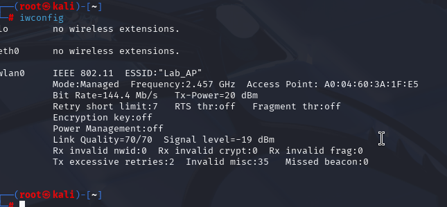
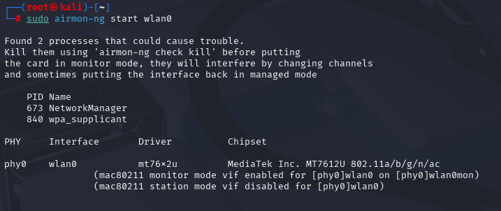
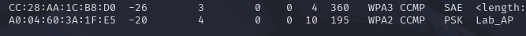
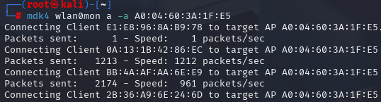
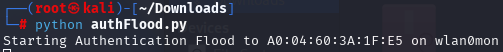

# Authentication Flooding

> **Disclaimer:**  
> This tutorial is provided strictly for **educational purposes** and **authorized penetration testing**.  
> Do **not** use these tools on networks you do not own or have explicit permission to test.  
> Unauthorized use is **illegal** and may result in criminal prosecution.
> Please refence [Consequences](../Legal/) for details regarding misuse.

---

## Table of Contents

- [Overview](#overview)
- [Prerequisites](#prerequisites)
- [Step 1: Enable Monitor Mode](#step-1-enable-monitor-mode)
- [Step 2: Target a Desired Access Point](#step-2-target-a-desired-access-point)
- [Step 3: Using mdk4 to Launch Attack](#step-3-using-mdk4-to-launch-attack)
- [Step 4: Automate It Using Python](#step-4-automate-it-using-python)
- [Final Thoughts](#final-thoughts)

---

## Overview

In this tutorial, you’ll learn how to:
- Enable monitor mode on a wireless adapter with `airmon-ng`
- Use `airodump-ng` to find nearby Access Points and connected devices
- With `mdk4` run that authenticaiton flood
- Automate the process with `python` and `scapy` library

## Authentication DoS Attack
Sends fake authentication frames with MAC address to an access point which can fill up the access point's association table and stress the logging system. This attack is meant as a Denial-of-Service (DoS) attack.


---

## Prerequisites

- A computer running **Kali Linux**
- A **wireless adapter that supports monitor mode**
  - In this lab I leverage the **HAK5 MK7AC WiFi Adapter**
- An access point that can use the WPA2-Personal protocol **AND** is using the 2.4GHz transmission frequency [**DON'T HAVE AN AP? CREATE ONE HERE!!**](../Fake Access Point/)
  - In this lab I leverage the **NETGEAR R6400-100NAS** *Circa 2017*
- Tools that already should be included in Kali:
  - `mdk4`
  - `airodump-ng`
  - `python`
- Superuser (`sudo`) privileges

---

## Step 1: Enable Monitor Mode

Just like with nearly all other attacks we need to put the access point into monitor mode. This allows us to detect all the Wi-Fi traffic, read packets not address to the wireless card, and discover all the clients and networks.

### Enable Monitor Mode

First, open up a new terminal on your machine. Using iwconfig you can find the network devices attached to the system.
*Note: I'm using root so I don't need to add sudo to my commands*

```bash
iwconfig
```



Next, use the airmon-ng to set the device in monitor mode. This will allow us to listen to all traffic.

```bash
airmon-ng start <Device Name> 
```



---

## Step 2: Target a Desired Access Point

Now that we have a wireless adapter that is in monitor mode it's time to determine the BSSID and Channel of the access point we are going to attack. Using the **wland0mon** interface we can begin to seach for these access points. Please be aware this only works on the 2.4GHz signal.

```bash
airodump-ng wlan0mon
```



---

## Step 3: Using mdk4 to Launch Attack

Once you have the BSSID of the device you want to attack along with the channel it's operating on you are ready to launch an authentication flood attack using the mdk4 tool.

```bash
mdk4 wlan0mon a -a <BSSID>
```



**What does this command do?**
- `mdk4` is the tool we are using
- `wlan0mon` is the device we are using to attack with
- `a` is the type of attack we are selecting in this case authentication flooding
- `-a` lets us attack a specific AP


**What's this doing?**
This attack is attempting to deny service to legitimate clients filling up the AP's memory and processing using EAPOL-Start frames. This can make it difficult to access the network from a device making the service unusable.

Now unfortunatly the access point I was testing with was not susceptable to this type of attack as it has protections in place. However, on lesser and older routers, this could have caused issues with access to the network.

---

## Step 4: Automate It Using Python

I'll leave this up to you, but I recommend trying to create a Python script to handle this process. To create the fake frame I used a library called scapy. Scapy can forge packets for a number of different protocols.

The methods you'll need to for this atack to work are as follows:
1. A method to generate random MAC addresses
2. A method to craft and send authentication requests (use Scapy)
3. A loop to generate the MAC address and then create the fake frame then some time to sleep

You can see my script running.



---

## Final Thoughts

This lab provided a hands-on demonstration of how wireless networks can be disrupted through the abuse of authenication requests. Although these attacks do no affect most modern equipment. Outdated devices could be vulnerable. 

What stood out most from this exercise is even though older devices have a number of different exploits even a nearly ten year old device has some much need security features to avoid simple attacks like the one demonstrated in this lab. 

Using this knowledge for malicious activity could lead to real-life consequences.

Never attack an access point without the consent of the owner. Attacks like this should **only** occur under the following conditions:

- You own the network and all devices involved.
- You are conducting tests in a **controlled lab environment**.
- You have **explicit, written authorization** from the network owner.

**Please Reference [THIS](../Legal/) Page Before Conducting Any Testing**

---

#### Lab Best Practices

- Always run tests in a **private, isolated network** where you control both the access point and clients.
- Use external Wi-Fi adapters so you don’t disrupt your main internet connection.
- Clean up after the lab: stop monitor mode and restore default interface settings.
- Respect privacy—never store, share, or analyze packets containing third-party information outside the lab.


---


© [CryptidRegrex], [2025]. This work is licensed under a [Creative Commons Attribution-ShareAlike 4.0 International License](https://creativecommons.org/licenses/by-sa/4.0/).

