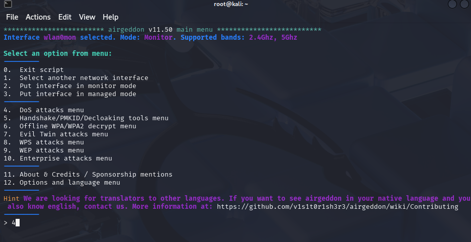

# Wi-Fi Cracking: Monitor Mode

> **Disclaimer:**  
> This tutorial is provided strictly for **educational purposes** and **authorized penetration testing**.  
> Do **not** use these tools on networks you do not own or have explicit permission to test.  
> Unauthorized use is **illegal** and may result in criminal prosecution.
> Please refence [Consequences](../Legal/) for details regarding misuse.

---

## Table of Contents

- [Overview](#overview)
- [Prerequisites](#prerequisites)
- [Step 1: Enable Monitor Mode](#step-1-enable-monitor-mode)
- [Step 2: Enter the DoS Attack Menu](#step-2-enter-the-dos-attack-menu)
- [Step 3: Target a Desired Access Point](#step-3-target-a-desired-access-point)
- [Step 4: Setup Beacon DoS Attack](#step-4-setup-beacon-dos-attack)
- [Step 5: Monitor the Results](#step-5-monitor-the-results)
- [Final Thoughts](#final-thoughts)

---

## Overview

In this tutorial, you’ll learn how to:
- Enable monitor mode on a wireless adapter
- Use `airgeddon` to find nearby Access Points and connected devices
- Choose your desired access point target
- Flood the network with mirrored access points

## Beacon DoS Attack
1. Fake Beacon Frames: The attacker floods a wireless network with a large number of fake beacon frames. Beacon frames are used to announce that a network is available. 
2. Imitation Networks: These beacon frames carry information about fake wireless networks, including their SSIDs (network names) and BSSIDs (unique identifiers).
3. Overwhelm and Disruption: When wireless devices scan for available networks, they will see a multitude of these fake networks. This can overwhelm the device's ability to find and connect to legitimate networks, disrupting service or preventing connection altogether. 

---

## Prerequisites

- A computer running **Kali Linux**
- A **wireless adapter that supports monitor mode**
  - In this lab I leverage the **HAK5 MK7AC WiFi Adapter**
- An access point that can use the WPA2-Personal protocol **AND** is using the 2.4GHz transmission frequency [**DON'T HAVE AN AP? CREATE ONE HERE!!**](../Fake Access Point/)
  - In this lab I leverage the **NETGEAR R6400-100NAS** *Circa 2017*
- Tools that already should be included in Kali:
  - `airgeddon`

- Superuser (`sudo`) privileges

---

## Step 1: Enable Monitor Mode

Just like with nearly all other attacks we need to put the access point into monitor mode. This allows us to detect all the Wi-Fi traffic, read packets not address to the wireless card, and discover all the clients and networks.

### Enable Monitor Mode

First, boot up airgeddon in the console. As you can see below my inteface is called wlan0. 
*Note: I'm using root so I don't need to add sudo to my commands*

```bash
airgeddon
```

Next, select the option to enable monitor mode. For me it's option number 2.


---

## Step 2: Enter the DoS Attack Menu

Airgeddon comes with a few options to attack wireless networks. This includes some denial of service attacks. Under that option, 4 for me, there will be a few different method of distrupting service. 




After some time elaspse my router was able to be located aptly called **Lab_AP**. Noting the BSSID **A0:04:60:3A:1F:E5** and the channel, thrid column to the right **9** I have what I need to begin an attack.

---

## Step 3: Target a Desired Access Point

Next you should be able to explore targets in your area. Using the option to find targets let the scan continue until you find the access point you want to run the attack against.

*Note depending on where you are conducting this attack there might be several possible choices. BE CAREFUL to select YOUR test access point*

---

## Step 4: Setup Beacon DoS Attack

Option number 8 allows us to setup an beacon frame attack. This will start to spawn a number of frames that signafy a network is available. These APs will never connect and could cause distruption to service or at least confusion for the user. 


Next the setup will ask another question about using DoS pursuit mode. For this lab there is no reason to enable this choose "N".


Now that the setup is complete once you hit **Enter** the attack will begin and you can use any client device to monitor the additional access points spawn with the same SSID.


---

## Step 5: Monitor the Results

Finally, a new window will spawn and you should see the BSSID and SSID with a number of packets per second sent out on the network. This signifies packets are sending out on the network and if someone tries to connect it's a gamble to pick the correct one.


As you can see here's a few snapshots of my device's list of available networks. I was able to see 4 of these networks up at one point and I have a screenshot of three of the four. Connecting to one of them allowed me to obtain an IP address and connect to the network. The others would fail to connect any time I choose the incorrect one. 


Generated Beacon Frame


Real Network


Generated Beacon Frame


## Final Thoughts

This lab provided a hands-on demonstration of how wireless networks can be disrupted through the abuse of management frames, particularly beacon frames, which are often overlooked in security planning. Using Airgeddon we explored how adversaries can generate fake beacon frames to flood the wireless spectrum, effectively conducting a Denial of Service (DoS) attack on nearby access points and clients.

What stood out most from this exercise was how inherently unprotected beacon frames are by design, since they’re part of the 802.11 management plane and are broadcast without encryption or authentication. This creates a unique attack vector that requires no cracking of encryption or authentication just noise to the network. The simplicity of execution highlights another weakness in Wi-Fi protocol design.

Using this knowledge for malicious activity could lead to real-life consequences.

Never attack an access point without the consent of the owner. Attacks like this should **only** occur under the following conditions:

- You own the network and all devices involved.
- You are conducting tests in a **controlled lab environment**.
- You have **explicit, written authorization** from the network owner.

**Please Reference [THIS](../Legal/) Page Before Conducting Any Testing**

---

#### Lab Best Practices

- Always run tests in a **private, isolated network** where you control both the access point and clients.
- Use external Wi-Fi adapters so you don’t disrupt your main internet connection.
- Clean up after the lab: stop monitor mode and restore default interface settings.
- Respect privacy—never store, share, or analyze packets containing third-party information outside the lab.


---


© [CryptidRegrex], [2025]. This work is licensed under a [Creative Commons Attribution-ShareAlike 4.0 International License](https://creativecommons.org/licenses/by-sa/4.0/).

