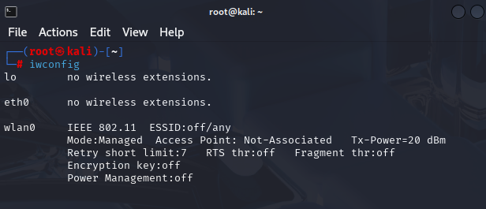
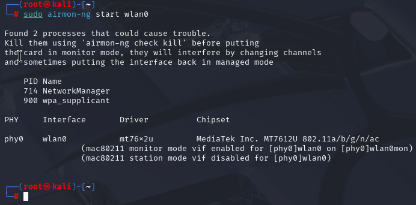
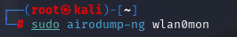
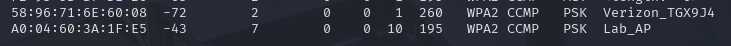
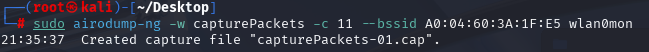
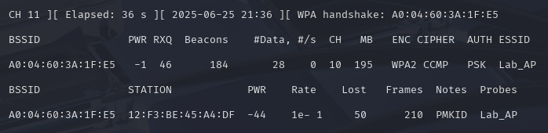
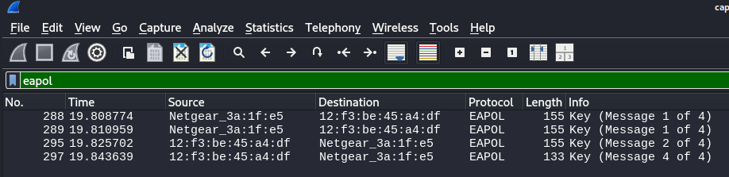
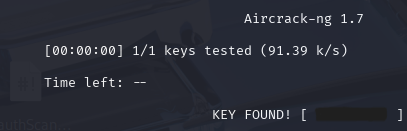

# Wi-Fi Cracking: Monitor Mode

> **Disclaimer:**  
> This tutorial is provided strictly for **educational purposes** and **authorized penetration testing**.  
> Do **not** use these tools on networks you do not own or have explicit permission to test.  
> Unauthorized use is **illegal** and may result in criminal prosecution.
> Please refence [Consequences](../Legal/) for details regarding misuse.

---

## Table of Contents

- [Overview](#overview)
- [Prerequisites](#prerequisites)
- [Step 1: Enable Monitor Mode](#step-1-enable-monitor-mode)
- [Step 2: Discover the Target Access Point](#step-2-discover-the-target-access-point)
- [Step 3: Target a Desired Access Point](#step-3-target-a-desired-access-point)
- [Step 4: Capture WPA handshake via Deauthentication Attack (Optional)](#step-4-capture-wpa-handshake-via-deauthentication-attack-optional)
- [Step 5: Caputre WPA Handshake](#step-5-capture-wpa-handshake)
- [Step 6: Open the Captured Packets in Wireshark](#step-6-open-the-captured-packets-in-wireshark)
- [Step 7: Cracking the Password](#step-7-cracking-the-password)
- [Final Thoughts](#final-thoughts)

---

## Overview

In this tutorial, you’ll learn how to:
- Enable monitor mode on a wireless adapter
- Use `airodump-ng` to find nearby Access Points and connected devices
- Capture information and use Wireshark to complete an analysis on the data
- Crack a password using the handshake captured

---

## Prerequisites

- A computer running **Kali Linux**
- A **wireless adapter that supports monitor mode and packet injection**
  - In this lab I leverage the **HAK5 MK7AC WiFi Adapter**
- An access point that can use the WPA2-Personal protocol **AND** is using the 2.4GHz transmission frequency [**DON'T HAVE AN AP? CREATE ONE HERE!!**](../Fake Access Point/)
  - In this lab I leverage the **NETGEAR R6400-100NAS** *Circa 2017*
*Note this lab hinges on these two commponents. I would recommend using an older router*
- Tools that already should be included in Kali:
  - `airmon-ng`
  - `airodump-ng`

- Superuser (`sudo`) privileges

---

## Step 1: Enable Monitor Mode

Just like with the deauthenction attack we need to enable monitor mode to begin working on this attack. This allows us to detect all the Wi-Fi traffic, read packets not address to the wireless card, and discover all the clients and networks.

### Enable Monitor Mode

First, identify your wireless interface. As you can see below my inteface is called wlan0. Depending on how many wireless interfaces you have the one you want to choose may vary. 
*Note: I'm using root so I don't need to add sudo to my commands*

```bash
iwconfig
```



Next, using airmon-ng, part of the Aircrack-ng suite, is used for enabling and utilizing monitor mode. Essentially this mode lets the user monitor Wi-Fi traffic and capture packets. Now that it's in monitor mode the way to access this interface is via the **wlan0mon**. 

```bash
sudo airmon-ng start wlan0
```



---

## Step 2: Discover the Target Access Point

Now that we have a wireless adapter that is in monitor mode it's time to determine the BSSID and Channel of the access point we are going to attack. Using the **wland0mon** interface we can begin to seach for these access points. Please be aware this only works on the 2.4GHz signal.

```bash
sudo airodump-ng wlan0mon
```



After some time elaspse my router was able to be located aptly called **Lab_AP**. Noting the BSSID **A0:04:60:3A:1F:E5** and the channel, thrid column to the right **9** I have what I need to begin an attack.



---

## Step 3: Target a Desired Access Point

Once you find the BSSID and Channel you begin to monitor a specific device which is critical to crack the key. The command is similar to the one used in the deatuthentication tutorial except this time we'll be writing the output of the packet capture to a file the `-w <filename>`. This is important for not only validating we captured the handshake, but also so we can crack it. Keep this command running until you've captured a handshake.

```bash
sudo airodump-ng --bssid <BSSID> --channel <CH> -w <filename> <monitor-interface>
```



---

## Step 4: Capture WPA handshake via Deauthentication Attack (Optional)

**NOTE: This is an optional step to procure the handshake packets**

Now using the skills from the 2nd Lab I highly recommend trying to use a deauthentication attack against your device connected to the test AP. Why do this? Most devices have a autoreconnect feature so if we for a client connected to the AP off the network then it will attempt to connected again, therefore creating a new handshake event for us to catpure. 

---

## Step 5: Capture WPA Handshake

To capture a handshake you need a client to make the initial handshake to acquire access to the AP. While the packet capture from step 3 is running go ahead and disconnect and reconnect a device to the AP. Once the client has acess again go ahead and end the capture from step 3. 



---

## Step 6: Open the Captured Packets in Wireshark

Now to see if the capture pulled the handshake informaiton. Using Wireshark you can assess the output. 

```bash
wireshark <filename>.cap
```


With Wireshark open search for **eapol**, this is short for Extensible Authentication Protocol over LAN used by the IEE 802.1X standard. Essentially it helps us sort out everything that isn't a handshake related packet.



---

## Step 7: Cracking the Password

This is were we can root out the password using some brute force. Leveraging the `aircrack-ng` tool we can use the packets we've caputred containg the handshake packets as well as a password list to try and find the password. You can leverage [this](https://github.com/josuamarcelc/common-password-list) repo's password list rockyou.txt or, since you know the password, create a txt file with the plain text password on a new line. 

```bash
sudo aircrack-ng <capture-file>.cap -w <path-to-wordlist>
```



---

## Final Thoughts

While tools like `aircrack-ng`, `airodump-ng`, and packet analyzers such as `Wireshark` are incredibly valuable for understanding wireless security, they must be used with caution, purpose, and proper authorization. Just like in previous lab deauthentication there could be consequences for doing this against a non-consenting party. 

Using this knowledge for malicious activity could lead to real-life consequences.

Cracking a Wi-Fi password—even with a valid handshake—and capturing packets on LAN or Wi-Fi networks should **only** occur under the following conditions:

- You own the network and all devices involved.
- You are conducting tests in a **controlled lab environment**.
- You have **explicit, written authorization** from the network owner.

**Please Reference [THIS](../Legal/) Page Before Conducting Any Testing**

---

### Key Takeaways

- Enabled **monitor mode** on a wireless interface using `airmon-ng`.
- Identified networks and clients using `airodump-ng`.
- Captured WPA2 **four-way handshakes**.
- Pulled packet captures in **Wireshark** using `eapol` as a filter.
- Performed dictionary-based **password cracking** with `aircrack-ng`.

---

#### Security Concepts

- Understanding the importance of **WPA2 handshake authentication**.
- Observed how weak passwords are vulnerable to dictionary attacks. Especially with dictionaries readily available.
- Realized the limitations of WPA2 and the value of upgrading to **WPA3**.
- Practiced interpreting and filtering real traffic in packet capture tools.
- Explored how **client-device behavior** (like reconnecting) can be used against a network for capturing handshake packets

---

#### Lab Best Practices

- Always run tests in a **private, isolated network** where you control both the access point and clients.
- Use external Wi-Fi adapters so you don’t disrupt your main internet connection.
- Clean up after the lab: stop monitor mode and restore default interface settings.
- Respect privacy—never store, share, or analyze packets containing third-party information outside the lab.


---


© [CryptidRegrex], [2025]. This work is licensed under a [Creative Commons Attribution-ShareAlike 4.0 International License](https://creativecommons.org/licenses/by-sa/4.0/).

