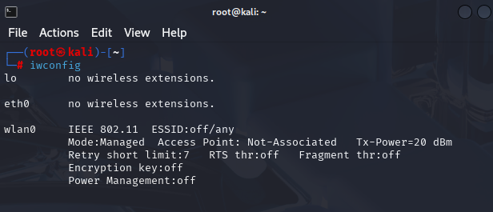

# Wi-Fi Deauthentication Attack Tutorial (Kali Linux)

> **Disclaimer:**  
> This tutorial is provided strictly for **educational purposes** and **authorized penetration testing**.  
> Do **not** use these tools on networks you do not own or have explicit permission to test.  
> Unauthorized use is **illegal** and may result in criminal prosecution.

---

## Table of Contents

- [Overview](#overview)
- [Prerequisites](#prerequisites)
- [Step 1: Enable Monitor Mode](#step-1-enable-monitor-mode)
- [Step 2: Discover the Target Access Point (AP)](#step-2-discover-the-target-access-point-ap)
- [Step 3: Isolate Clients Connected to the AP](#step-3-isolate-clients-connected-to-the-ap)
- [Step 4: Perform a Deauthentication Attack](#step-4-perform-a-deauthentication-attack)
- [Step 5: Optional Bash Script to Automate Discovery](#step-5-optional-bash-script-to-automate-discovery)
- [Final Thoughts](#final-thoughts)

---

## Overview

In this tutorial, you’ll learn how to:
- Enable monitor mode on a wireless adapter
- Use `airodump-ng` to find nearby Access Points and connected devices
- Target a specific AP and identify connected clients (stations)
- Use `aireplay-ng` to deauthenticate a client, useful for WPA handshake capture

---

## Prerequisites

- A computer running **Kali Linux**
- A **wireless adapter that supports monitor mode and packet injection**
  - In this lab I leverage the **HAK5 MK7AC WiFi Adapter**
- An access point that can use the WPA2-Personal protocol **AND** is using the 2.4GHz transmission frequency
  - In this lab I leverage the **NETGEAR R6400-100NAS** *Circa 2017*
*Note this lab hinges on these two commponents. I would recommend using an older router**
- Tools that already should be included in Kali:
  - `airmon-ng`
  - `airodump-ng`
  - `aireplay-ng`
- Superuser (`sudo`) privileges

---

## 🛰️ Step 1: Enable Monitor Mode

First, identify your wireless interface:

```bash
iwconfig

