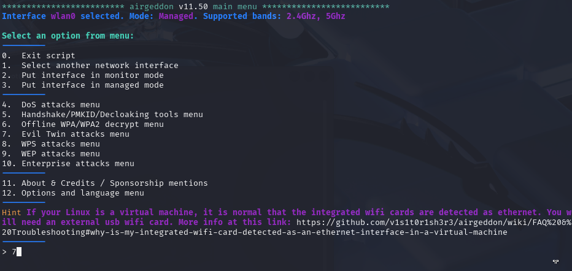
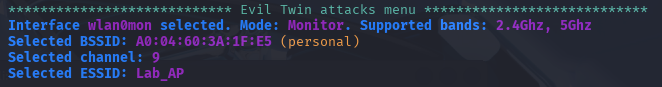
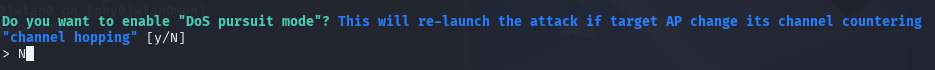

# Evil Twin Attack Setup Using Airgeddon

> **Disclaimer:**  
> This tutorial is provided strictly for **educational purposes** and **authorized penetration testing**.  
> Do **not** use these tools on networks you do not own or have explicit permission to test.  
> Unauthorized use is **illegal** and may result in criminal prosecution.
> Please refence [Consequences](../Legal/) for details regarding misuse.

---

## Table of Contents

- [Step 1: Install Airgeddon](#step-1-install-airgeddon)
- [Step 2: Launch Airgeddon and Select Wireless Interface](#step-2-launch-airgeddon-and-select-wireless-interface)
- [Step 3: Navigate to Evil Twin Attack Menu](#step-3-navigate-to-evil-twin-attack-menu)
- [Step 4: Choose Evil Twin with Captive Portal (Option 9)](#step-4-choose-evil-twin-with-captive-portal-option-9)
- [Step 5: Scan for Target Access Point](#step-5-scan-for-target-access-point)
- [Step 6: Launch Deauthentication Attack via mdk4](#step-6-launch-deauthentication-attack-via-mdk4)
- [Step 7: Disable DoS Pursuit Mode (Optional)](#step-7-disable-dos-pursuit-mode-optional)
- [Step 8: Capture WPA/WPA2 Handshake (Optional)](#step-8-capture-wpawpa2-handshake-optional)
- [Step 9: Configure the Captive Portal Template](#step-9-configure-the-captive-portal-template)
- [Step 10: Start the Evil Twin Attack](#step-10-start-the-evil-twin-attack)
- [Final Thoughts](#final-thoughts)

---

## Prerequisites

- A computer running **Kali Linux**
- A **wireless adapter that supports monitor mode and packet injection**
  - In this lab I leverage the **HAK5 MK7AC WiFi Adapter**
- An access point that can use the WPA2-Personal protocol **AND** is using the 2.4GHz transmission frequency [**DON'T HAVE AN AP? CREATE ONE HERE!!**](../Fake Access Point/)
  - In this lab I leverage the **NETGEAR R6400-100NAS** *Circa 2017*
*Note this lab hinges on these two commponents. I would recommend using an older router*
- Tools:
  - `airmon-ng`
  - `airgeddon`
- Superuser (`sudo`) privileges


## Step 1: Install Airgeddon

Start by installing Airgeddon using your package manager. On Kali Linux or Debian-based systems:

```bash
sudo apt-get update
sudo apt-get install airgeddon
```


---

## Step 2: Launch Airgeddon and Select Wireless Interface

Start by installing Airgeddon using your package manager. On Kali Linux or Debian-based systems:

```bash
sudo airgeddon
```
Airgeddon will first prompt you to select a compatible wireless interface. Only interfaces that support monitor mode and packet injection will be displayed. Select your desired wireless interface (e.g., wlan0) and Airgeddon will attempt to enable monitor mode on it, renaming it (e.g., wlan0mon).


---

## Step 3: Navigate to Evil Twin Attack Menu

Once inside the main menu, navigate through the available options:
- Choose Menu Option 7: Evil Twin attacks.



This menu contains different attack variations. Airgeddon will scan your system for required dependencies and confirm whether all necessary components (like hostapd, dnsmasq, lighttpd) are present.

---

## Step 4: Navigate to Evil Twin Attack Menu

To continue with a credential harvesting scenario, select:
- Option 9 – Evil Twin with Captive Portal

This configures Airgeddon to:
- Clone the target access point
- Host a rogue network
- Redirect victims to a web page (captive portal) where credentials can be captured


---

## Step 5: Scan for Target Access Point

Airgeddon will begin scanning the area for nearby wireless access points.
- Let it run for about 10–30 seconds to gather network data
- Press Ctrl+C to stop the scan once you see your target
- A numbered list will appear. Type the number corresponding to the AP you wish to clone and press Enter

This locks in the target network for the Evil Twin attack.


**This is the selected access point**



---

## Step 6: Launch Deauthentication Attack via mdk4

Now, you need to disconnect legitimate clients from the target AP to force them to connect to your rogue access point.
- Choose Option 1: Deauth attack using mdk4
- mdk4 is a modern toolkit for Wi-Fi testing and includes advanced deauthentication and jamming features.

This method sends forged deauthentication frames to connected clients, causing them to disconnect from the original AP.


---

## Step 7: Disable DoS Pursuit Mode (Optional)

Airgeddon will ask whether you want to enable DoS Pursuit Mode.
- Choose No unless you already have a previously captured WPA handshake
- Leave the timeout value as default unless you have a specific reason to modify it

This prepares Airgeddon to capture a WPA handshake in the next step.



---

## Step 8: Capture WPA/WPA2 Handshake (Optional)

The tool will try to capture the 4-way WPA handshake by disconnecting an active client and listening for reconnection attempts.

This process typically lasts 20–30 seconds and results in one of the following:
- Success: Handshake captured and saved
- Fail: No client reconnects in time

If successful, the handshake will later be used to verify any password the victim submits to the captive portal.

Device is connected to the Lap_AP


**Configuring the settings for the attack**


**Capturing the handshake**


---

## Step 9: Configure the Captive Portal Template

You’ll now choose how the fake login page should appear to the victim.

Options include:
- Default portal: Generic "Wi-Fi login" look
- Advanced templates: Imitate specific router brands (e.g., Netgear, TP-Link, Cisco)
- Custom portals: Use your own HTML/CSS if preferred
- Pick a portal that closely matches the vendor of the real AP for maximum believability.

You can also choose the language of the portal to match your target's locale.

**Setting up the portal language**


**Option to update the portal template**


---

## Step 10: Start the Evil Twin Attack


Airgeddon will now launch the complete Evil Twin attack environment. It will open multiple terminal windows to handle:
- Fake AP broadcasting (via hostapd)
- DHCP/DNS spoofing (via dnsmasq)
- Web server hosting the captive portal (via lighttpd)
- Credential logging
- Deauthentication flooding

Allow the attack to run for several minutes. Eventually, clients will:
1. Disconnect from the real AP
2. Automatically reconnect to the rogue AP
3. Be redirected to the captive portal
4. Submit credentials thinking they are logging back in

These credentials will appear in your terminal and/or be saved to log files.

**Terminals open during attack**


**User gets disconnected from good AP and reconnecte to Evil Twin AP**


**After entering the password to the actual AP**


**Capturing the password**


## Final Thoughts

- Airgeddon automates complex wireless attacks like Evil Twin, making it suitable for training and testing
- Deauthentication and captive portals are powerful tools for social engineering in wireless contexts
- Captured WPA handshakes can be used to validate credentials, improving the realism of the attack
- Results will vary depending on the security posture of target devices and networks


© [CryptidRegrex], [2025]. This work is licensed under a [Creative Commons Attribution-ShareAlike 4.0 International License](https://creativecommons.org/licenses/by-sa/4.0/).

