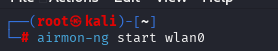
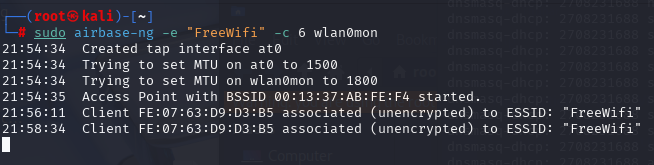
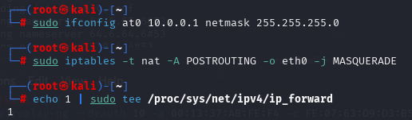
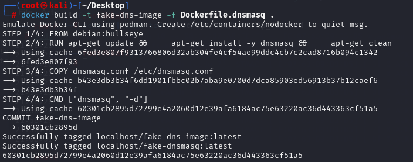
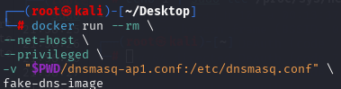
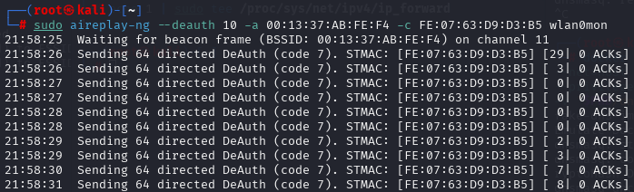

# Fake Access Point

> **Disclaimer:**  
> This tutorial is provided strictly for **educational purposes** and **authorized penetration testing**.  
> Do **not** use these tools on networks you do not own or have explicit permission to test.  
> Unauthorized use is **illegal** and may result in criminal prosecution.
> Please refence [Consequences](#final-thoughts) for details regarding misuse.

## Prerequisites

- A computer running **Kali Linux**
- A **wireless adapter that supports monitor mode and packet injection**
  - In this lab I leverage the **HAK5 MK7AC WiFi Adapter**

---

## Required Hardware: Wireless Adapter

You'll need a **USB wireless network adapter** that supports **monitor mode** and **packet injection**. These features are essential for capturing traffic and performing Wi-Fi attacks.

  - In this lab I leverage the **HAK5 MK7AC WiFi Adapter**. 
  - There are other options, at better price points so please be mindful.

---

## Software Tools: Aircrack-ng & dnsmasq

One of the most powerful Wi-Fi auditing tools available is **Aircrack-ng**. This suite includes a range of utilities designed for wireless reconnaissance, injection, cracking, and more. This should come with the Kali distribtion you install otherwise you can install it on most machines.

Here are just a few components from the Aircrack-ng suite:

- `airmon-ng`: Enables monitor mode on your wireless adapter
- `airbase-ng`: Creates rogue access points


---

## Capabilities of Aircrack-ng

The Aircrack-ng suite supports a wide range of wireless testing operations, including:

- Enabling/disabling monitor mode
- Capturing and analyzing wireless packets
- Performing deauthentication and injection attacks
- Cracking WEP/WPA/WPA2 keys
- Setting up fake access points
- Testing driver and adapter capabilities


---

> **Note:** Make sure your wireless adapter is properly recognized by your system. You can check this using `iwconfig` to confirm interface names like `wlan0` or `wlan1`.

## Step 1: Update Aircrack-ng

Kali Linux comes with **Aircrack-ng**, the wireless penetration testing suite, pre-installed. To ensure you’re running the latest version, execute the following command to update and upgrade your system:

```bash
sudo apt-get update && sudo apt-get upgrade
```

---

## Step 2: Enable Monitor Mode on Wireless Interface

The first step is to enable **monitor mode** on your wireless interface (usually `wlan0`). This allows your system to capture and inject wireless traffic.

```bash
sudo airmon-ng start wlan0
```



---

## Step 3: Directory for AP Setup

Make a directory to store this information, and then create a new dnsmasq.conf file


Now to setup the configuration within the file for the dnsmasq Docker file. I've called min dnsmasq.conf.

```bash
interface=at0
dhcp-range=10.0.0.20,10.0.0.250,255.255.255.0,12h
dhcp-option=3,10.0.0.1
dhcp-option=6,10.0.0.1
server=8.8.8.8
server=8.8.4.4
server=64.6.64.6
server=64.6.65.6
log-queries
log-dhcp
listen-address=127.0.0.1
```

`interface=at0`

Specifies the fake network interface that will be created using `airbase-ng`.  
This is the virtual interface for the fake access point.

---

`dhcp-range=10.0.0.20,10.0.0.250,255.255.255.0,12h`

Defines the DHCP address pool.  
We’re using the `10.0.0.0/24` subnet. This will lease IPs between `10.0.0.20` to `10.0.0.250`, with a lease time of **12 hours**.

---

`dhcp-option=3,10.0.0.1`

DHCP Option 3 specifies the **gateway address**.  
The `10.0.0.1` address will act as the **fake default gateway** for clients.

---

`dhcp-option=6,10.0.0.1`

DHCP Option 6 sets the **DNS server** to be assigned to clients.  
In our scenario, clients will use `10.0.0.1` — our rogue DNS for resolution of any domains.

---

`server=8.8.8.8`, `8.8.4.4`, `64.6.64.6`, `64.6.65.6`

These lines define **public DNS forwarders** used by dnsmasq.  
- `8.8.8.8` and `8.8.4.4` are Google's DNS servers  
- `64.6.64.6` and `64.6.65.6` are Verisign's DNS servers

Dnsmasq will forward client DNS queries to these resolvers.

---

`log-queries`

Enables **DNS query logging**.  
This will allow you to view all domain lookups made by clients connected to the fake access point.

---

`log-dhcp`

Enables **DHCP lease logging**.  
This helps monitor which IPs have been assigned and which clients are active on the fake access point.

---

`listen-address=127.0.0.1`

Limits dnsmasq to only listen on the **loopback interface** (`127.0.0.1`).  
This helps contain the rogue DHCP/DNS service locally and prevents it from affecting other interfaces.

**My Config File**


---

## Step 4: Create Dockerfile

Creating the dockerfile to kick off the dnsmasq server. This allows us to spawn multiple configurations with different dnsmasq.conf files if needed.

```bash
# Run dnsmasq on container start
FROM debian:bullseye

RUN apt-get update && \
    apt-get install -y dnsmasq && \
    apt-get clean

# Run dnsmasq on container start
COPY dnsmasq.conf /etc/dnsmasq.conf

# Run dnsmasq on container start
CMD ["dnsmasq", "-d"]
```

## Step 5: Creating the Access Point

Create an Access Point using the `airbase-ng`. This will start broadcasting on the 2.4GHz band and should be accessable to devices. However, this doesn't have the capacity to assign an IP to the client yet.

```bash
sudo airbase-ng -e "FreeWifi" -c 6 wlan0mon
```



---

## Step 6: Configure the `at0` Interface

Create dnsmasq.conf

Save this as whatever you like in my case dnsmasq-ap1.conf (if I'm creating multiple APs):

```bash
interface=at0
dhcp-range=10.0.0.10,10.0.0.100,12h
dhcp-option=3,10.0.0.1
dhcp-option=6,10.0.0.1
log-queries
log-dhcp
bind-interfaces
```

- interface=at0: DNS/DHCP binds to virtual AP
- dhcp-range: IPs to assign to clients
- option 3: gateway
- option 6: DNS server

---

## Step 6: Configure the Virtual Interfaces

- airbase-ng creates a virtual interface at0 that acts like a network card for your fake AP.

```bash
sudo ifconfig at0 10.0.0.1 netmask 255.255.255.0 up
```
- Sets the IP address and brings up the interface

```bash
sudo iptables -t nat -A POSTROUTING -o eth0 -j MASQUERADE
```
- Enables NAT for internet forwarding (assuming eth0 is your real internet interface)

```bash
echo 1 | sudo tee /proc/sys/net/ipv4/ip_forward
```

**What this Looks Like:**



---

## Step 7: Build the Docker Image

Build the docker image so we can spawn a run from it's container. 

```bash
docker build -t fake-dns-image -f Dockerfile.dnsmasq .
```



---


## Step 8: Run the Docker Container

Run the docker container with the correct dnsmasq*.conf files you need to spawn multiple APs



---

## Finished!

You now have a Fake AP that can assign IPs to clients. Now you can connnect a device to test with and run attacks against the AP like you would an real access point!

**Example**




© [CryptidRegrex], [2025]. This work is licensed under a [Creative Commons Attribution-ShareAlike 4.0 International License](https://creativecommons.org/licenses/by-sa/4.0/).

