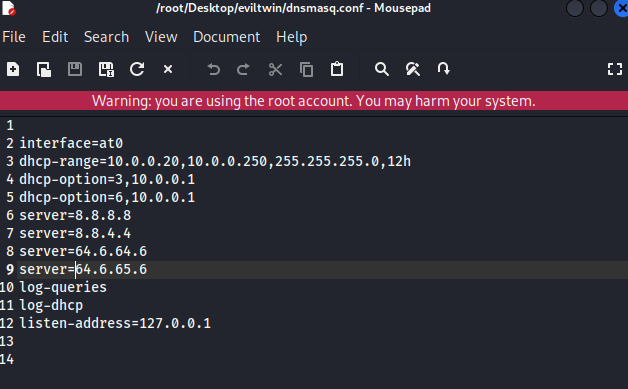
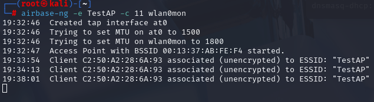
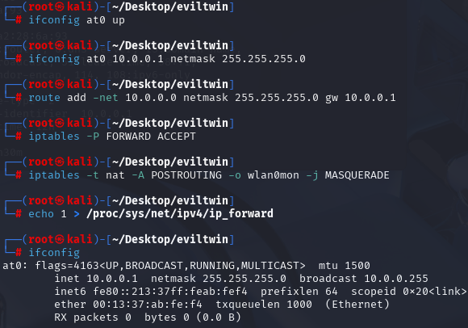
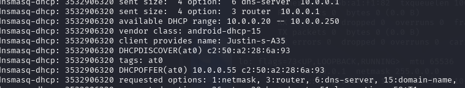

# Fake Access Point

> **Disclaimer:**  
> This tutorial is provided strictly for **educational purposes** and **authorized penetration testing**.  
> Do **not** use these tools on networks you do not own or have explicit permission to test.  
> Unauthorized use is **illegal** and may result in criminal prosecution.
> Please refence [Consequences](#final-thoughts) for details regarding misuse.

## Prerequisites

- A computer running **Kali Linux**
- A **wireless adapter that supports monitor mode and packet injection**
  - In this lab I leverage the **HAK5 MK7AC WiFi Adapter**

---

## Required Hardware: Wireless Adapter

You'll need a **USB wireless network adapter** that supports **monitor mode** and **packet injection**. These features are essential for capturing traffic and performing Wi-Fi attacks.

  - In this lab I leverage the **HAK5 MK7AC WiFi Adapter**. 
  - There are other options, at better price points so please be mindful.

---

## Software Tools: Aircrack-ng & dnsmasq

One of the most powerful Wi-Fi auditing tools available is **Aircrack-ng**. This suite includes a range of utilities designed for wireless reconnaissance, injection, cracking, and more. This should come with the Kali distribtion you install otherwise you can install it on most machines.

Here are just a few components from the Aircrack-ng suite:

- `airmon-ng`: Enables monitor mode on your wireless adapter
- `airodump-ng`: Captures wireless traffic and displays network info
- `aireplay-ng`: Performs deauthentication and replay attacks
- `aircrack-ng`: Cracks WEP and WPA/WPA2-PSK keys using captured handshakes
- `airbase-ng`: Creates rogue access points
- `airdecap-ng`, `airdecloak-ng`, `airdrop-ng`: Various tools for processing and analyzing wireless traffic

---

## Capabilities of Aircrack-ng

The Aircrack-ng suite supports a wide range of wireless testing operations, including:

- Enabling/disabling monitor mode
- Capturing and analyzing wireless packets
- Performing deauthentication and injection attacks
- Cracking WEP/WPA/WPA2 keys
- Setting up fake access points
- Testing driver and adapter capabilities


---

> **Note:** Make sure your wireless adapter is properly recognized by your system. You can check this using `iwconfig` to confirm interface names like `wlan0` or `wlan1`.

## Step 1: Update Aircrack-ng

Kali Linux comes with **Aircrack-ng**, the wireless penetration testing suite, pre-installed. To ensure you’re running the latest version, execute the following command to update and upgrade your system:

```bash
sudo apt-get update && sudo apt-get upgrade
```

## Step 2: Install dnsmasq

Installing a DNS forwarder and DHCP server that we'll use in creating the access point.

```bash
sudo apt-get install dnsmasq
```

Find the default configuration or create a config file.

```bash
/etc/dnsmasq.conf
```

Leverage your favorite text editor like `nano` or `leafpad` to edit the config file.

```bash
sudo nano /etc/dnsmasq.conf
```

## Step 3: Directory for AP Setup

Make a directory to store this information, and then create a new dnsmasq.conf file

```bash
mkdir eviltwin
cd eviltwin
nano dnsmasq.conf
```

Now to setup the configuration within the file

```bash
interface=at0
dhcp-range=10.0.0.20,10.0.0.250,255.255.255.0,12h
dhcp-option=3,10.0.0.1
dhcp-option=6,10.0.0.1
server=8.8.8.8
server=8.8.4.4
server=64.6.64.6
server=64.6.65.6
log-queries
log-dhcp
listen-address=127.0.0.1
```

`interface=at0`

Specifies the fake network interface that will be created using `airbase-ng`.  
This is the virtual interface for the fake access point.

---

`dhcp-range=10.0.0.20,10.0.0.250,255.255.255.0,12h`

Defines the DHCP address pool.  
We’re using the `10.0.0.0/24` subnet. This will lease IPs between `10.0.0.20` to `10.0.0.250`, with a lease time of **12 hours**.

---

`dhcp-option=3,10.0.0.1`

DHCP Option 3 specifies the **gateway address**.  
The `10.0.0.1` address will act as the **fake default gateway** for clients.

---

`dhcp-option=6,10.0.0.1`

DHCP Option 6 sets the **DNS server** to be assigned to clients.  
In our scenario, clients will use `10.0.0.1` — our rogue DNS for resolution of any domains.

---

`server=8.8.8.8`, `8.8.4.4`, `64.6.64.6`, `64.6.65.6`

These lines define **public DNS forwarders** used by dnsmasq.  
- `8.8.8.8` and `8.8.4.4` are Google's DNS servers  
- `64.6.64.6` and `64.6.65.6` are Verisign's DNS servers

Dnsmasq will forward client DNS queries to these resolvers.

---

`log-queries`

Enables **DNS query logging**.  
This will allow you to view all domain lookups made by clients connected to the fake access point.

---

`log-dhcp`

Enables **DHCP lease logging**.  
This helps monitor which IPs have been assigned and which clients are active on the fake access point.

---

`listen-address=127.0.0.1`

Limits dnsmasq to only listen on the **loopback interface** (`127.0.0.1`).  
This helps contain the rogue DHCP/DNS service locally and prevents it from affecting other interfaces.

**My Config File**





## Step 4: Enable Monitor Mode on Wireless Interface

The first step is to enable **monitor mode** on your wireless interface (usually `wlan0`). This allows your system to capture and inject wireless traffic.

Run the following command:

```bash
sudo airmon-ng start wlan0
```

## Step 5: Creating the Access Point

Create an Access Point using the `airbase-ng`

```bash
sudo airbase-ng -e "TestAP" -c 11 wlan0mon
```




## Step 6: Configure the `at0` Interface

```bash
sudo ifconfig at0 up
sudo ifconfig at0 10.0.0.1 netmask 255.255.255.0
sudo route add -net 10.0.0.0 netmask 255.255.255.0 gw 10.0.0.1
sudo iptables -P FORWARD ACCEPT
sudo iptables -t nat -A POSTROUTING -o wlan0mon -j MASQUERADE
echo 1 | sudo tee /proc/sys/net/ipv4/ip_forward
```

**What does this do?**

- ifconfig at0 up: Activates the virtual interface.

- ifconfig at0 10.0.0.1 ...: Assigns the interface an IP address and subnet.

- route add ...: Adds a static route to forward client traffic.

- iptables -P FORWARD ACCEPT: Allows packet forwarding.

- iptables ... MASQUERADE: Enables NAT so clients can access external networks.

- echo 1 > /proc/sys/net/ipv4/ip_forward: Enables system-level IP forwarding.

What this Looks Like:




## Step 7: Start dnsmasq

We'll start the DHCP/DNS service using the dnsmasq via the config file created earlier.

```bash
sudo dnsmasq -C ~/Desktop/eviltwin/dnsmasq.conf -d
```

You should see output showing active DHCP leases and DNS requests

## Step 8: Connect to the Fake Access Point

Now you should be able connect to your fake AP and see it within the output of your dnsmasq log!




---

© [CryptidRegrex], [2025]. This work is licensed under a [Creative Commons Attribution-ShareAlike 4.0 International License](https://creativecommons.org/licenses/by-sa/4.0/).

