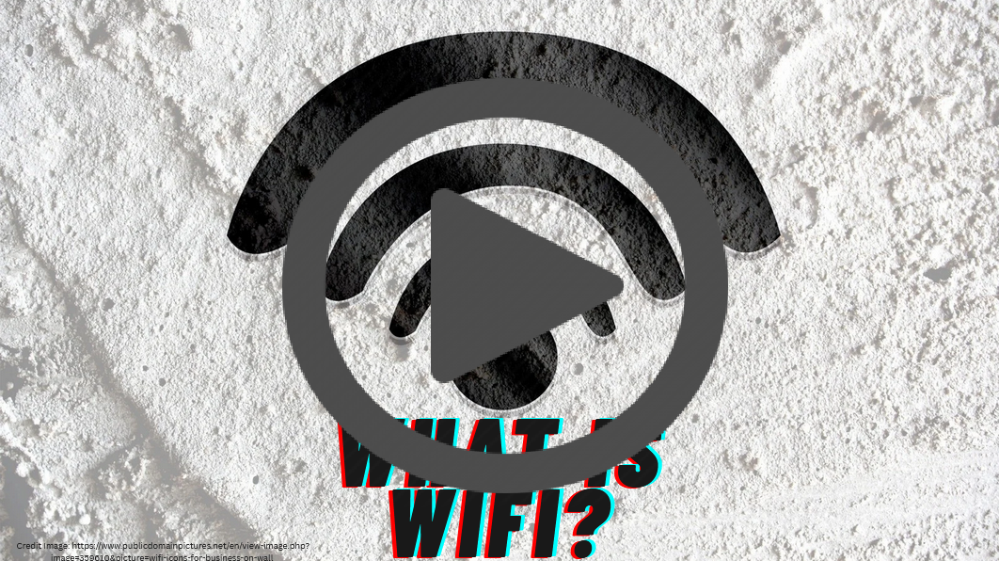
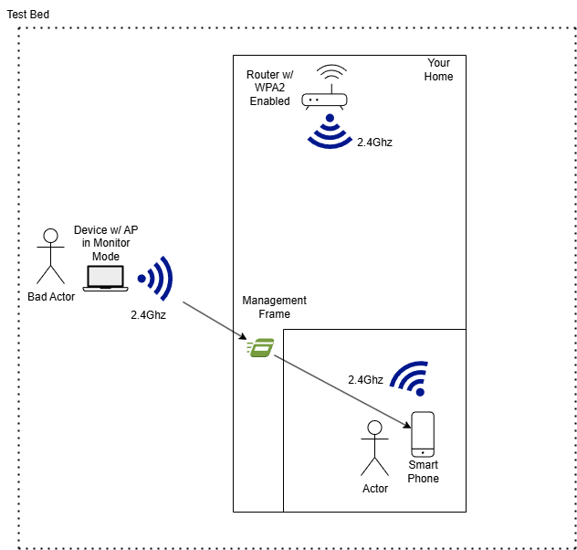
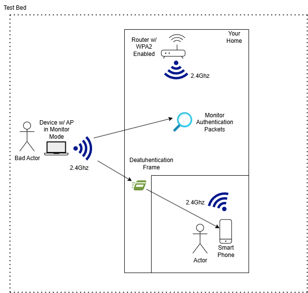
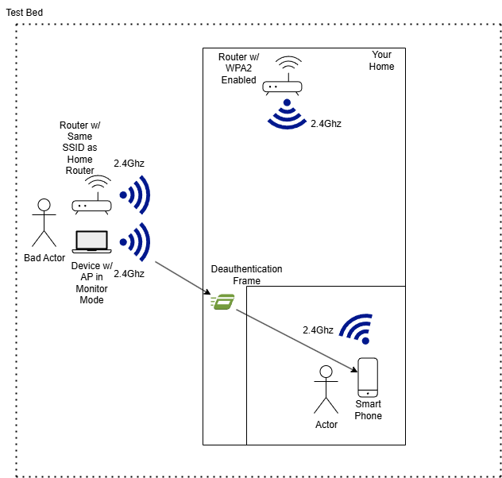

# Why Insecure Wi-Fi Should Worry You

**Watch the Video by clicking on the image below**

The wireless networks we take advantage of each day are seemingly innocuous, but few are aware of the potential threats associated with this technology. These vulnerabilities can threaten your data, privacy, and safety online and you need to protect yourself. In this paper I discuss the current state, existing threats, discuss and evaluate models for consumer protection, and provide some proposals for better wireless protection. 
92% of the networks I scanned today are still using outdated security protocols on their wireless devices in the Nebraska area.  Security protocols to most people are not something they spend time worrying about. After all, if your internet works and you have a password on your Wi-Fi, everything is protected, at least that’s what most think. 

These older protocols, like WEP, WPA, and WPA2, have known weaknesses that have been publicly disclosed for years. One of the most notorious vulnerabilities is known as KRACK, short for Key Reinstallation Attack. It can be used to compromise your connection, disrupt your access, hijack your session, or in some cases, steal sensitive credentials. These are not obscure technical threats, but actionable attacks a bad actor can use in practice. The vulnerabilities are real and anyone with the right knowledge and tools, most of them free, can take advantage of them.

What’s worse is that most people have no idea that the router blinking in the corner of their living room is a possible security risk. There’s currently no universal or intuitive system in place that relays this information to consumers whether their devices are secure or vulnerable. While those of us in the field may know where to identify and test these flaws, the average person probably doesn’t, and this could leave the majority of people exposed to security vulnerabilities.  

 
## Data Breaches and the Everyday Cost

In the past, data breaches were rare enough to make headlines. Today, they’re commonplace. According to Lampariello, a reporter at WGME, 2024 saw 3,158 documented cyber incidents (Lampariello, 2025). IBM reports that the global average cost of a data breach last year reached 4.9 million dollars (IBM, 2024). These are not just losses to corporations but the loss of the user’s information too. This information could include name, email, financial data, habits. Once exposed, that data can be used for anything from identity theft to fraud.

Despite these statistics, there are still few protections in place for everyday consumers when it comes to the networks they use, which form the foundation of their digital lives. Whether it’s your smartphone, your tablet, your work laptop, or your smart home devices, nearly all of them connect through a wireless access point, and many of which are vulnerable to cyber-attacks.

Wireless systems are a part of what can make up a secure network, one that mitigates the possibility of a data breach from ever happening. Each data breach is unique in type of attack vectors a bad actor utilizes and giving actor another vector is like leaving your door unlocked. With some of these protections being as simple as updating the firmware on your router it would be negligent to ignore. This can lead to exposed data, loss of privacy, and financial loss just as observed in previous data breaches.

## Working Models: NHTSA and HIPPA

Consumer protection exists in other areas of our world. These protections are designed to provide ways to report, conduct investigations, and disseminate information that benefits products and services we value. There are a couple fantastic examples of these protections in action that could benefit the technology sector and specifically your Wi-Fi. 

One of these shine as a guiding example of consumer protections. The National Highway Traffic Safety Administration, or NHTSA, is a government agency that oversees vehicle safety. If a car is found to have a manufacturing defect that might put people at risk, the NHTSA investigates. Consumers can go to a website, enter their VIN or license plate, and find out instantly if their car is under a safety recall. They can even report a safety problem if they notice something concerning. That input from the public helps experts identify patterns and determine whether vehicles on the road are safe.

This example of transparency and accountability does not currently exist for wireless devices, whether that be the access point or the device connecting to it. There is no centralized system where a consumer can look up their router’s model number and see whether it’s considered vulnerable. There’s no simple way to report a device that lacks basic modern protection like WPA3 support. Also, there’s not even a straightforward process for manufacturers to notify the public when a security flaw is found. This lack of centralized systems introduces a dependency on the user having a fundamental understanding of technology, keeping up with vulnerabilities, and knowing how to mitigate them. 

Another interesting parallel is the Health Insurance Portability and Accountability Act (HIPAA). HIPAA mandates healthcare organizations to maintain administrative, physical, and technical safeguards to protect sensitive health information. If a breach occurs, covered entities are required to notify affected individuals, the federal government, and in some cases, the media. There’s a formal investigation process and steep penalties for non-compliance. For consumers we should have a similar way to inform those affected of vulnerable devices like an access point.

In Nebraska, there is an FBI field office in Omaha where cybercrimes can be reported, and there are national systems like the Internet Crime Complaint Center. However, these mechanisms are reactive, not preventive. They exist, more so, to report after a disaster has occurred. We need a system that is more proactive, something that mirrors what NHTSA does with vehicle recalls. A good way to improve this is to create a platform to warn, investigate, and ultimately resolve technology-based safety concerns before they can be exploited. Since this doesn’t exist, we don’t have a way of knowing what devices are and are not vulnerable.
This can fit into Wi-Fi, by using similar tools and structures. Having a way to intake security or wireless concerns to a database is the first step in the process. It’s unlikely that every issue or hole in a product is caught so having a way to report these concerns is paramount to proactive protection for consumers. In addition, staffing a team to sort, evaluate, and investigate each concern is next as this requires the time and care of professionals to determine a root cause. Then some way to disseminate that information, like a searchable database might be a good way to get this information to us. 

## Why This Hits Close to Home

Most have not noticed changes to Wi-Fi and therefore don’t know that they could be affected by these outdated security protocols. This can be attributed to the lack of consumer protections that could inform us of these failures to security. 

During the early 2000s and 2010s, millions of WPA and WPA2 routers were sold and deployed across homes in America. Parks Associates, a website, states, “Vast majority (80%) of US households have a home network router” (Parks Associates, 2024). Having personal internet and a wireless access point is nearing a necessity. This means that everything from banking to job applications, and even entertainment will capture and use private information to make transactions across the web. This means that security should be at the forefront of our minds. Today there are still so many users who are using outdated hardware and software which could expose information if the right threat actor were to attack. The number of WPA2 devices found in my research was outstanding and just meant that no one has done a good job at disseminating this information. 

WPA2 is what was discovered most in my research with most devices using that protocol to protect the transmission of their data from client devices, like a phone, to the access point. This protocol has flaws that are easy to exploit, and the tools are free. It’s an old standard that’s better than nothing, however, just barely. 

WPA3 introduced features such as Protected Management Frames (PMF), which defend against attacks that older routers simply can’t handle based on the hardware requirements of WPA3. (Extreme Networks), states that WPA3 can use transition modes with older protocols, but with the older vulnerable WPA2. This means that using an older security protocol, even on a WPA3 secure device, makes it vulnerable to the same attacks.

KRACK is a prime example. This attack allows an adversary to decrypt your wireless communication and even inject malicious traffic into your network. In simple terms, it means that someone nearby could listen to your internet traffic or redirect you to fake websites. Despite the existence of this threat and others like it, devices still exist that are vulnerable to this attack vector. There’s no warning label. No recall. No way for most consumers to know they’re at risk.

This is the equivalent of someone driving around in a vehicle that’s been recalled for having faulty brakes, but the owner was never contacted. With cars, we have a system to fix that. With routers and other internet-connected devices, no system exists. 

As mentioned, WPA3 can mitigate the threat of attack to your devices. However, that doesn’t mean it’s as simple as an update. This requires hardware changes that don’t translate in older hardware. Meaning this is not going to be upgradeable on older devices and likely a cost for the consumer to transition to the newest protocol. Also, WPA3 isn’t marketed well as for a consumer to understand the benefit would require research and time to determine the worth. This doesn’t mean making this information more accessible isn’t possible, but even if that were so it would be another expenditure for the consumer. 

## A National Reporting and Validation System

To mitigate the issues outlined previously, I propose creating a consumer-facing national reporting system to protect us consumers. Right now, there is currently no method for a consumer to report a vulnerable or outdated access point. That’s where we need to start. This public-facing system should allow anyone to submit a report on a specific device model. That information could then be evaluated by cybersecurity professionals, and if a risk is found, the device could be flagged. That flag should be accessible to anyone so if a user is deciding what device to buy, or whether to upgrade, they can refer to the database before making a purchase. 

Unfortunately, tracking every user who owns a vulnerable router would be a challenge without some kind of registration which cars already benefit from. However, that doesn’t mean we can’t provide consumers with the tools to protect themselves. Even a simple website that allows people to search for their device and get clear information about the current vulnerabilities tied to the device would be a good step forward. If the router can’t be updated due to hardware limitations, a recommendation for upgrading to a newer model could be provided. For example, the Windows 11 hardware requirement for TPM 2.0. If your computer doesn’t support it, you simply can’t run the operating system. This forces better security to prevent attacks on users. 

Additionally, no laws today prevent the sale of outdated and vulnerable wireless devices. Devices like wireless access points, security cameras, and IoT devices should not be allowed to circulate if they are known to lack fundamental security protections or remain unpatched after a vulnerability is disclosed. Manufacturers and sellers should be held accountable for continuing to push products that put consumers at risk.

A regulation that prohibits the sale of insecure devices would allow consumers to pursue legal recourse when damage occurs due to negligence. More importantly, it creates a forward-moving framework to improve public safety, much like how automobile safety laws were born from decades of advocacy, investigation, and reform.

To summarize, a way to report, investigate, and inform users via a similar model to the NHTSA or HIPPA examples allows the consumer to protect themselves and others. This is a proactive model that gives each consumer a way to voice their concerns and experiences with insecure Wi-Fi devices. 

## What a Breach Looks Like in Practice

To clearly illustrate the immediate risk to consumers, I performed practical tests. I used a WPA2 access point and was able to disconnect a device using what’s called a deauthentication attack (see Figure 1). Once the device tried to reconnect, I captured the handshake which is the digital version of a device proving it knows the password. Using that data, I was able to brute-force the password and access the network (see Figure 2).

**Figure 1. Deauthentication Attack**

**Figure 2. Capture Authenticaiton Packets**

In a separate test, I created an “evil twin” which is a fake version of the same wireless network. When I disconnected the original device, it attempted to reconnect to mine instead. Once that happened, I could see all the traffic it sent and received. Everything it did passed through my fake access point (see Figure 3). These attacks didn’t require expensive tools or obscure knowledge. They were performed using publicly available software and equipment that anyone can download and use.

**Figure 3. Evil Twin Attack**

WPA 3 exists to prevent these attacks through Protected Management Frames. But for anyone still using WPA2, they are fully exposed. With nearly 92% of networks in my scan still running WPA2 or worse, there is no question about it, these devices need to be addressed. These tests underscore the ease of exploiting common Wi-Fi vulnerabilities without sophisticated tools.

## Moving Forward

Even without immediate legislative change, consumers can take steps now to improve their Wi-Fi security. The Federal Trade Commission even has a guide called “How To Secure Your Home Wi-Fi Network” with high-level easy to work with information about how to implement securities (Federal Trade Commission, 2022). For example, looking up the model number of your router, which is usually printed on the back or underside, and checking the manufacturer’s website. Verify that the latest firmware is installed. Learn whether your device supports WPA3. If you need to log into your router, you can typically do so by entering 192.168.1.1 or 192.168.0.1 into a browser, where you’ll find the wireless settings and can see what security protocol is enabled. 

WPA3 is not backwards compatible, unfortunately. Froehlich author at TechTarget states, “…more importantly, WPA3 won't run on just any wireless hardware and software. The standard relies on Protected Management Frames, which often require users to update their hardware with chips engineered to support the technology.” (Froehlich, 2020). This means that most users will need to seek an upgrade that supports the latest security protocol standard. Unfortunately, this is a hardware difference that can’t be upgraded in older routers. 

Overall, this process can be confusing, especially for those without a background in technology, but that is precisely why we need to simplify it. We don’t expect car owners to inspect their own brakes, rebuild engines, or test airbag systems. We simply tell them when something’s wrong and provide a process to fix it. That same model should be applied to digital infrastructure, especially as our dependence on wireless technology continues to grow.

Simple education and understanding of Wi-Fi and the devices that use it help enrich this process. If consumers provide better feedback, making investigations more straightforward, and even faster results. Something as simple as this goes a long way to strengthening a system designed to benefit Wi-Fi for consumers.

## Conclusion

Wireless security isn’t just a small concern for IT professionals. It’s a public data issue. Your private data, your communications, and your devices all depend on the security of your network. We can’t keep expecting users to solve problems they don’t even know exist. We need transparency and some type of enforced regulation. We need a system that puts consumer safety at the forefront of it all.

Writing to your local representatives is the first place to start. Ask for the creation of a national device vulnerability database, one that lets consumers easily check the security status of the devices they own or plan to buy. Ask for laws that hold manufacturers accountable when they ship or sell outdated and vulnerable products. You can start with some language such as, “I am writing to urge you to support legislation that addresses a growing but overlooked threat to consumer safety: the use and sale of outdated and vulnerable digital devices, particularly wireless access points, and routers”. 

*Talking points should address the following topics:*

1.	A National Device Vulnerability Database - A centralized, publicly available and accessible system where consumers can search devices by model or serial number and view their security status and any known vulnerabilities.
2.	A Consumer Submission Portal - A government-hosted platform where anyone can report insecure or outdated devices, or a potential concern.
3.	Manufacturer Accountability Legislation - Laws that prevent manufacturers and retailers from continuing to sell devices with known, unpatched security issues or any vulnerabilities.

Just like with other safety issues the current government takes great lengths to address, digital security is one that needs to be considered. A portal to submit potential vulnerable devices, a database to capture those results, and a way for people to access this information should be possible. Having a way to protect us consumers of vulnerable devices without doing extensive research or having technical background should be a right. 

 
## References
Federal Trade Commission. (2022, December). How to secure your home Wi-Fi Network. Consumer Advice. https://consumer.ftc.gov/articles/how-secure-your-home-wi-fi-network 

Froehlich, A. (2020, March 11). Can WPA2 be upgraded to WPA3?: TechTarget. Search Networking. https://www.techtarget.com/searchnetworking/answer/Can-WPA2-be-upgraded-to-WPA3 

IBM. (2024). Cost of a data breach 2024. Cost of a Data Breach Report 2024 . https://www.ibm.com/reports/data-breach 

Lampariello, D. (2025, January 29). Data breaches continued to surge in 2024, New Report shows. WGME. https://wgme.com/news/i-team/data-breaches-continued-to-surge-in-2024-new-report-shows 

Parks Associates. (2024, April 22). Vast majority (80%) of US households have a home network router; 28% report intentions to purchase. https://www.parksassociates.com/blogs/ce-pr/vast-majority-80-of-us-households-have-a-home-network-router-28-report-intentions-to-purchase 

---

© [CryptidRegrex], [2025]. This work is licensed under a [Creative Commons Attribution-ShareAlike 4.0 International License](https://creativecommons.org/licenses/by-sa/4.0/).

