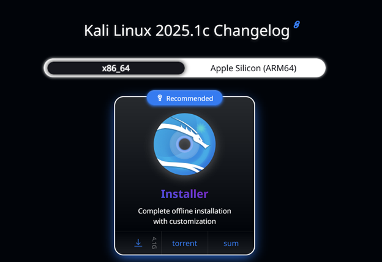
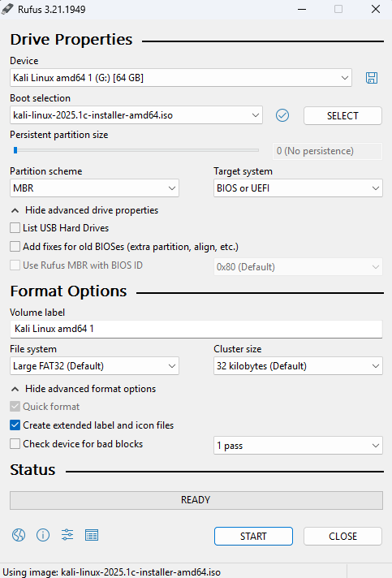

# 📥 Step 1 – Download Kali Linux ISO

## 🔗 Official Download

Visit the official [Kali Linux Downloads page](https://www.kali.org/get-kali/) and choose:

- **Installer ISO** (for bare metal)

Example:

---
title: Step 2 – Create Bootable USB
---

# Step 2 – Create a Bootable USB Drive

## Rufus Download

- **Windows**: [Rufus](https://rufus.ie)

### ✅ Rufus (Windows)

1. Insert your USB drive (at least 8 GB).
2. Open Rufus.
3. Select:
   - **Device**: your USB stick
   - **Boot selection**: the `.iso` file
   - **Partition scheme**: MBR (or GPT for UEFI)
4. Click **Start**.

Example:

---
title: Step 3 – BIOS/UEFI Configuration
---

# Step 3 – Configure BIOS/UEFI

## What to Do
*Note that you many need to determine your exact settings to boot from this drive*

1. Reboot your computer.
2. Press key to enter BIOS (often `F2`, `F10`, `DEL`, or `ESC`).
3. Enable/disable:
   - **Boot from USB**: Enable
   - **UEFI or Legacy Boot**:
     - Use UEFI if your USB was built for it
     - Use Legacy for MBR schemes
4. Set the **USB Drive** as the first boot option.
